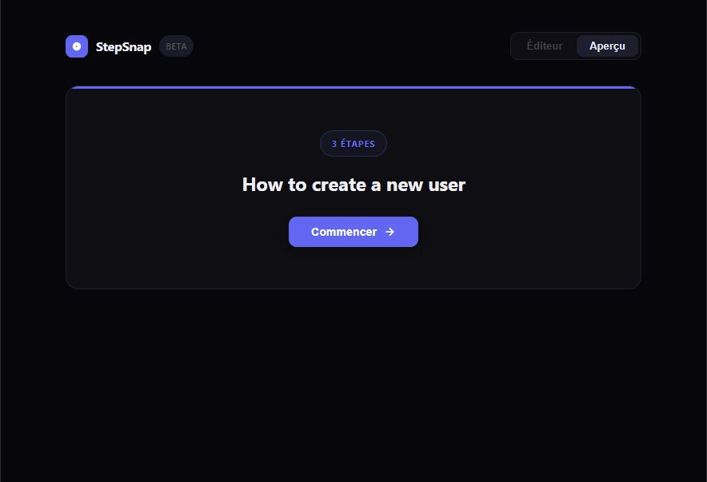
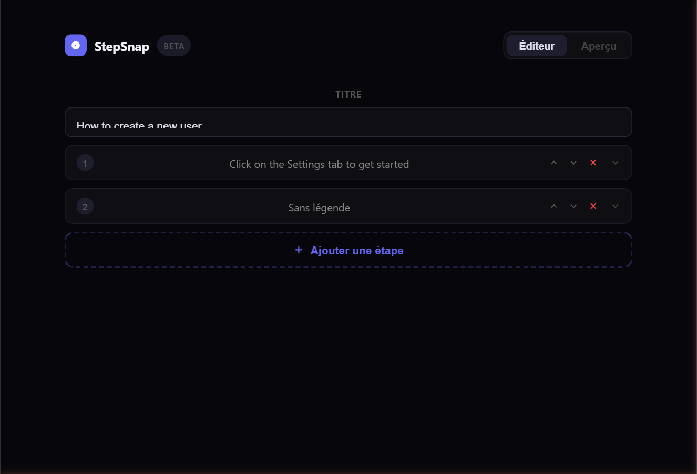
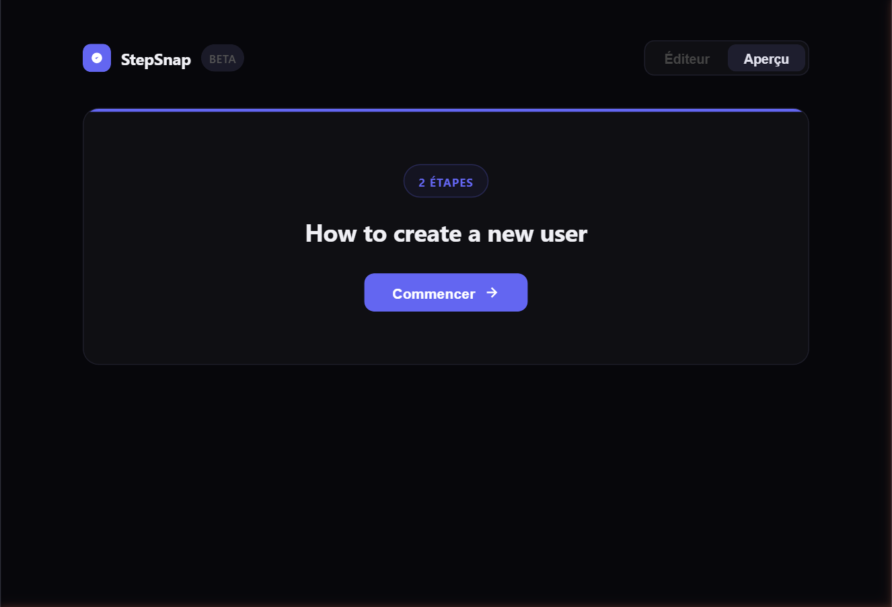

# StepSnap

**Annotated screenshot walkthrough builder & viewer for React — open-source alternative to Scribe.**

Create step-by-step visual guides with annotated screenshots, smooth transitions, and auto-zoom. Works in any React app or as a standalone script on any webpage.

---

## Preview



| Builder | Viewer |
|---------|--------|
|  |  |

---

## Features

- **Builder** — upload screenshots, click to place annotations (circle or arrow), resize, reorder steps
- **Viewer** — slide-by-slide walkthrough with smooth transitions, animated annotations, progress bar
- **Auto-zoom** — optionally zoom in on the annotation point when a slide appears
- **Click anywhere** to advance to the next step
- **Storage-agnostic** — plug in your own upload function (Vercel Blob, S3, Cloudinary…)
- **Standalone embed** — use on any webpage without React via a single `<script>` tag
- **Zero runtime dependencies** — only React as a peer dep

---

## Installation

```bash
npm install stepsnap
```

---

## Usage

### Viewer only

Display a pre-built walkthrough:

```tsx
import { WalkthroughViewer } from 'stepsnap'
import type { WalkthroughData } from 'stepsnap'

const data: WalkthroughData = {
  title: 'How to create a user',
  steps: [
    {
      id: '1',
      imageUrl: 'https://example.com/step1.png',
      caption: 'Click on the Settings tab',
      annotation: {
        type: 'circle',
        x: 72.5,     // % from left
        y: 34.0,     // % from top
        color: '#6366f1',
        animated: true,
        size: 40,
        zoom: true,
      },
    },
  ],
}

export default function MyPage() {
  return <WalkthroughViewer data={data} accentColor="#6366f1" />
}
```

### Builder + Viewer

Let users create and preview walkthroughs:

```tsx
import { useState } from 'react'
import { WalkthroughBuilder, WalkthroughViewer } from 'stepsnap'
import type { WalkthroughData, UploadFn } from 'stepsnap'

// Wire up your own storage
const upload: UploadFn = async (file) => {
  const form = new FormData()
  form.append('file', file)
  const res = await fetch('/api/upload', { method: 'POST', body: form })
  const { url } = await res.json()
  return url
}

export default function Editor() {
  const [data, setData] = useState<WalkthroughData>({ title: '', steps: [] })

  return (
    <WalkthroughBuilder
      data={data}
      onChange={setData}
      onUpload={upload}
      accentColor="#6366f1"
    />
  )
}
```

---

## Standalone embed (no React required)

Build the embed bundle:

```bash
npm run build:embed
# outputs dist-embed/stepsnap-embed.js
```

Then drop it on any webpage:

```html
<div id="my-guide"></div>
<script src="stepsnap-embed.js"></script>
<script>
  StepSnap.mount('#my-guide', {
    accentColor: '#6366f1',
    data: {
      title: 'Getting started',
      steps: [
        {
          id: '1',
          imageUrl: 'https://example.com/step1.png',
          caption: 'Click the Settings tab',
          annotation: {
            type: 'circle',
            x: 72, y: 34,
            color: '#6366f1',
            animated: true,
            size: 40,
            zoom: true
          }
        }
      ]
    }
  })
</script>
```

To unmount:
```js
StepSnap.unmount('#my-guide')
```

> The embed bundle includes React — no other dependencies needed. Gzip size ~176 KB.

---

## API

### `<WalkthroughViewer />`

| Prop | Type | Default | Description |
|------|------|---------|-------------|
| `data` | `WalkthroughData` | required | Walkthrough content |
| `accentColor` | `string` | `#6366f1` | Theme color for badges, progress bar, buttons |

### `<WalkthroughBuilder />`

| Prop | Type | Default | Description |
|------|------|---------|-------------|
| `data` | `WalkthroughData` | required | Current walkthrough state |
| `onChange` | `(data: WalkthroughData) => void` | required | Called on every change |
| `onUpload` | `(file: File) => Promise<string>` | required | Upload handler — returns image URL |
| `accentColor` | `string` | `#6366f1` | Theme color |

---

## Data types

```ts
interface WalkthroughData {
  title: string
  steps: Step[]
}

interface Step {
  id: string
  imageUrl: string
  caption?: string
  annotation?: Annotation
}

interface Annotation {
  type: 'circle' | 'arrow'
  x: number        // % from left (0–100)
  y: number        // % from top (0–100)
  color: string    // CSS color
  animated: boolean
  size: number     // px — diameter for circle, height for arrow
  zoom: boolean    // auto-zoom on annotation when slide appears
}
```

---

## Development

```bash
git clone https://github.com/m0rnlngstar/stepsnap
cd stepsnap
npm install
npm run dev         # demo app at http://localhost:5173
npm run build       # build npm package → dist/
npm run build:embed # build standalone bundle → dist-embed/
```

---

## Roadmap

- [x] Publish to npm
- [ ] Keyboard navigation (← →)
- [ ] Fullscreen mode
- [ ] Export walkthrough as PDF / GIF
- [ ] Web Component (`<stepsnap-viewer>`) for non-JS frameworks

---

## Contributing

Contributions are welcome. Fork the repo, make your changes, and open a pull request — improvements get merged back into the project so everyone benefits.

---

## License

[AGPL-3.0-only](./LICENSE)

Free to use in your apps and websites. If you distribute or offer this software as a service, you must publish your source code under the same license.
